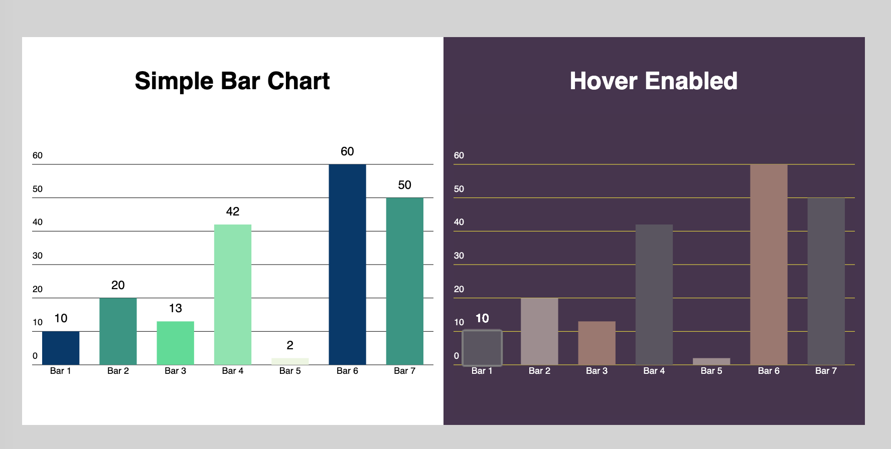

# SimpleCharts
Simple charting library in Vanilla js <br><br>

## Usage
For now download SimpleBarChart.js and place it in your project directory
```JavaScript
const data = [10,20,13,42,2,60,50]
const labels = ['Bar 1', 'Bar 2', 'Bar 3', 'Bar 4', 'Bar 5', 'Bar 6', 'Bar 7']

// Basic Example
const chart1 = new SimpleBarChart('bar', data, labels)
chart1.showValues = true;
chart1.draw();

// Customized Example
const chart2 = new SimpleBarChart('bar2', data, labels, '#46344E')
chart2.hoverValues = true;
chart2.gridColor = '#FAED26'
chart2.fontColor = '#fff'
chart2.colors.colors = [
    '#5A5560',
    '#9D8D8F',
    '#9B786F'
]
chart2.draw();
```

<br>
