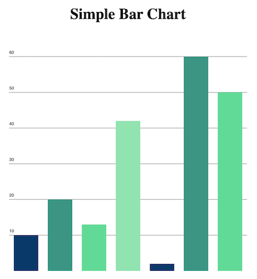

# SimpleCharts
Simple charting library in Vanilla js <br><br>

## Usage
For now download SimpleBarChart.js and place it in your project directory
```html
<canvas id="bar"></canvas>
<script src="./SimpleBarChart.js"><script/>
<script>
    window.onload = function() {
        const data = [10,20,13,42,2,60,50]
        const labels = ['Bar 1', 'Bar 2', 'Bar 3', 'Bar 4', 'Bar 5', 'Bar 6', 'Bar 7']
        const chart = new SimpleBarChart('bar', data, labels)
        chart.draw()
    }
<script/>
```

